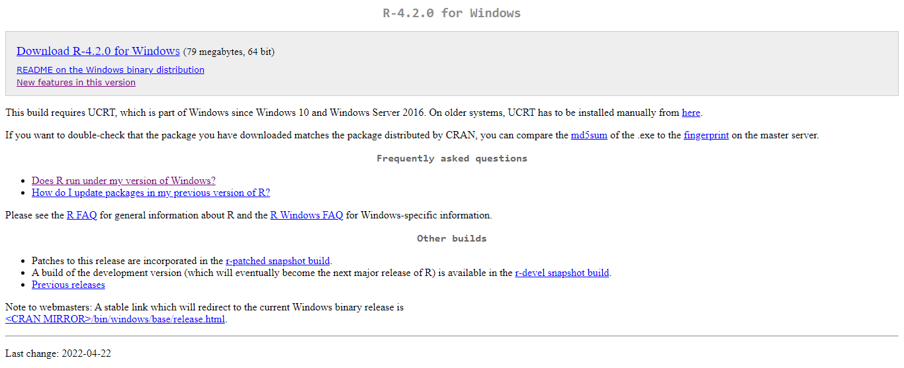
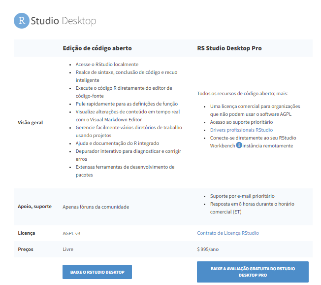
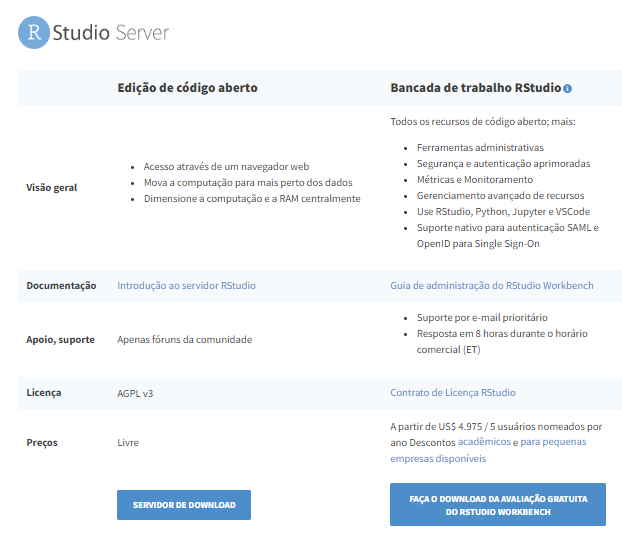

```{r setup, include=FALSE}
knitr::opts_chunk$set(echo = TRUE)
```
--- 

# Objetivo

Descrever as ideias básicas sobre o ambiente R:

- Como instalar o R e RStudio;
- Diferenças entre o R e a IDE RStudio;
- Como o R trabalha;
- Comandos elementares;
- Objetos;
- Manipulação com objetos;
- Importação de dados;
- Pacotes:
  - Instalação;
  - Como usar.

# Apresentação do relatório

Diante do objetivo do relatório, será apresentado nas próximas subseções, os pontos a serem discutidos.

## Como instalar o R e o RStudio
### Instalando o R

As versões binárias atuais do R são conhecidas por serem executadas no Windows 7 ou posterior. A versão R 4.1 é a última com suporte para versões de 32 bits.  O R 4.2.0 requer o Universal C Runtime (UCRT), que está incluído no Windows 10 e no Windows Server 2016, ou em versões mais recentes.Em versões anteriores, esse componente deve ser instalado manualmente antes da instalação do R.

Sendo assim, para instalar o R, caso o seu sistema operacional seja o Windows 10, ou superior, basta cliclar nesse link:  [Download do R](https://cran.r-project.org/bin/windows/base/){target="_blank"}. O download é totalmente gratuito.

O site também trás mais algumas informações sobre como continuar a instalação em sistemas operacionais mais antigos. 

{width="100%"}

### Instalando o RStudio

O RStudio está disponível em edições comerciais e de código aberto e é executado no desktop (Windows, Mac e Linux) ou em um navegador conectado ao RStudio Server.

Existem duas versões do RStudio, são elas:

- RStudio Desktop: Para executar o RStudio em sua área de trabalho;
- Servidor RStudio: Para centralizar o acesso e a computação.

Para utiliza-lo, você precisa anteriormente ter feito a instalação do R. Além disso, caso seja usuário de Windowns, seu sistema operacional precisa ser o Windows 10/11 (64 bits).

Para realizar o download do programa, basta clicar nesse link: [Download do RStudio](https://www.rstudio.com/products/rstudio/#rstudio-server){target="_blank"}. 

Nesse site você também poderá escolher qual é a versão do RStudio que mais lhe atende.

{width="80%"}

{width="80%"}

## Diferenças entre o R e a IDE RStudio

Podemos classificar o R com um ambiente de desenvolvimento integrado para realização de cálculos estatísticos e construção de gráficos. Além disso, ele também é considerado uma linguagem de programação, sendo utlizado por cientistas de dados e estatísticos para a manipulação e análise de dados.

{width="70%"}

Por outro lado, a IDE RStudio é apenas uma interface para o R. Sendo assim, ele possui alguns painéis e ferramentas que o tornam mais compreensível ao usuário.

{width="100%"}

## Como o R trabalha

Tudo que você realiza no R é armazenado em algum espaço na memória do seu computador. Tudo se trata de um objetivo, com características específicas e naturezas. Da mesma forma, interfaces para outros programas são parte do R, ou seja, O R é uma interface dentro de outras linguagens.

O R primeiro procura a variável dentro do ambiente da função e depois dentro do ambiente global. Ele prioriza o que está em um ambiente e depois parte para a análise de outro. Assim, é importante atentar-se a essa lógica de priorização, para que não haja erros inesperados. Esse processo pode ser descrito de uma forma mais clara através do esquema abaixo:

{width="100%"}

o R é uma linguagem baseada em linhas de comando, e as linhas de comando, são executadas uma de cada vez no console. Da mesma forma, a leitura de variáveis é sempre em coluna.

A velocidade do R é um pouco mais lenta quando comparada com as deamais linguagem, pois ele não conversa diretamente com a máquina.

O R trabalha no sistema internacional de medidas, ou seja, devemos separar os números por ponto e não por vírgula.

## Comandos elementares

Os comandos elementares consistem em expressões ou atribuições. Se uma expressão é dada como um comando, ela é avaliada, impressa (a menos que seja especificamente invisível) e o valor é perdido. Uma atribuição também avalia uma expressão e passa o valor para uma variável, mas o resultado não é impresso automaticamente.

Os comandos são separados por um ponto e vírgula (‘;’), ou por uma nova linha. Os comandos elementares podem ser agrupados em uma expressão composta por chaves (‘{‘ e ‘}’). Os comentários podem ser colocados quase em qualquer lugar, começando com uma “cerca” (‘#’), tudo no final da linha é um comentário.

Se um comando não estiver completo no final de uma linha, R vai gerar um prompt diferente, por padrão, até que o comando seja sintaticamente completo. 

## Objetos

Um objeto pode ser definido como uma entidade no ambiente R com características internas, a qual possui informações necessárias para interpretar sua estrutura e conteúdo.

A essas características, damos o nome de atributos e a forma como está o seu conteúdo, denominados de estrututa.

Realizando o código:

> x <- 200

É de censo comum acreditar que o objeto x recebe o valor 10. Porém, para Wickham (2019) essa afirmação é imprecisa e pode levar um entendimento equivocado sobre o que acontece de fato. Segundo ele, o correto é afirmar que o objeto 10 está se ligando a um nome.

O objeto não possui um nome, mas o nome tem um objeto. O símbolo que associa um objeto a um nome é o de atribuição, <-, isto é, a junção do símbolo de sigualdade menor e o símbolo de menos. 

É possível consultar qual o objeto associado ao nome. Para isso, o usuário precisa apenas digitar o nome no console e apertar a tecla ENTER.

## Manipulação com objetos

Todos os objetos, terão pelo menos dois tipos de atributos, chamados de atributos intrínsecos. Os demais atributos, quando existem, podem ser verificados pela função attributes(). A ideia dos atributos pode ser pensada como metadados, isto é, um conjunto de informações que caracterizam o objeto.

Os objetos também se dividem em tipos. O tipo vamos entender como a estrutura de como os dados estão organizados em um objeto, relacionados aos seus atributos. A estrutura mais simples de um objeto é o vetor atômico. Porém, existem outros tipos, tais como:

- Vetores
- Matrizes bidimensionais
- Matrizes multidimencionais
- Listas de dados
- Quadro de dados

## Importação de dados

A entrada de dados para a realização de análises estatísticas é algo que nos auxilia bastante no processo de programação. Podemos entrar com eles de várias maneiras, como por exemplo:

- Função *c*:

> a1 <- c(2, 5, 8)

> a1

[1] 2 5 8

> a2 <- c(23, 56, 34, 23, 12, 56)
 
> a2

  [1] 23 56 34 23 12 56
  
- Função *scan*:

Nela, você consegue digitar seus próprios dados

  y <- scan()
  
  11
  
  24
  
  35
  
  29
  
  39
  
  Read 6 items
  
  > y
  [1] 11 24 35 29 39 47
  
Existem ainda outros comandos, que nos auxiliam nesse processo, como: matrix(), list(), data.frame(), rep(),seq().

Porém, se os dados já estão disponíveis em formato eletrônico, ou seja, já foram digitados em outro programa, é possível importa-los para o R sem a necessidade de digitá-los novamente.

Podemos fazer isso através de linhas de comando. Para isso, é preciso que os arquivos a serem exportados estejam salvos com as extensões .txt ou .csv. 

Feito isso, utilizaremos a função read.table(). É interessante que os dados a serem importados estejam armazenados no mesmo diretório de trabalho no ambiente R. Caso o contrário, é preciso digitar o local exato de onde eles se encontram.

## Pacotes

Apesar de ser bastante completo, o programa também possibilita que o usuário realize o download de pacotes, fazendo com que tenhamos acesso a diferentes funções dentro da plataforma.

O pacote em R é um diretório de arquivos necessários para carregar um código de funções, dados, documentações de ajuda, testes, etc.

A estrutura básica de um pacote pode ser representada na imagem abaixo: 

{width="30%"}

### Instalação

A instalação de um pacote pode ser feita via CRAN. Assim, utilizamos a função install.packages(pkgs = "nome_pacote"), como por exemplo:

> install.packages("midrangeMCP")

Uma outra possibilidade é baixar o pacote fonte para o seu computador e instalá-lo, como:

> install.packages(pkgs = "./midrangeMCP.tar.gz", repos = NULL, type = "source")

É importante que arquivo do pacote esteja no diretório de trabalho do usuário. De outra forma, deve ser informado o local onde pacote se encontra no computador.

### Como usar

Finalizada a instalação do pacote, precisamos carregar e anexá-lo, para que possamos utilizar os recursos disponíveis no pacote, como funções, dados, etc. Isso significa, disponibilizar na memória e inseri-lo no caminho de busca, respectivamente. 

Para realizar essas duas ações ao mesmo tempo, use a função library() ou require(). A primeira função se for utilizada sem argumento algum, retorna todos os pacotes instalados na bibioteca de pacotes do R.