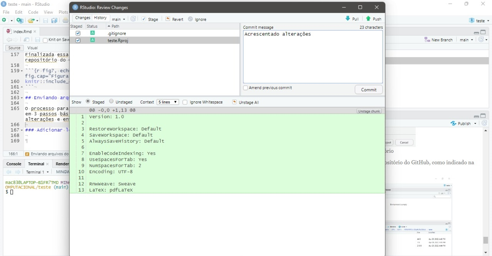

```{r setup, include=FALSE}
knitr::opts_chunk$set(echo = TRUE)
```
--- 

# Objetivo

Descrever como realizar o projeto relatórios com detalhamento.

# Apresentação do relatório

Diante do objetivo do relatório, será apresentado nas próximas subseções, os pontos a serem discutidos.

## Pacotes necessários

Como já aludido no [Relatório 1](https://mac8320.github.io/rel01/index.html){target="_blank"}, o pacote em R é um diretório de arquivos necessários para carregar um código de funções, dados, documentações de ajuda, testes, etc. Sendo assim, será preciso instalar alguns pacotes para a realização do projeto, são eles:

- `rmarkdown`: formato de arquivo que permite a criação de documentos dinâmicos utilizando R.

- `postcard`: coleção de modelos R Markdown para criar sites de página única simples e fáceis de personalizar.

- `knitr`: mecanismo para geração de relatórios dinâmicos com R. É um pacote na linguagem de programação R que permite a integração do código R em documentos LaTeX, LyX, HTML, Markdown, AsciiDoc e reStructuredText.

- `tinytex`: distribuição personalizada do LaTeX baseada no TeX Live, utilizado para criar documentos PDF a partir do R Markdown.

## Conceitos básicos sobre o RMarkdown

### Markdown

Segundo seu prórprio criador, John Gruber em 2004, podemos defini-lo como:

*Markdown é uma ferramenta de conversão de texto para HTML para escritores da web. O Markdown permite que você escreva usando um formato de texto simples fácil de ler e escrever e, em seguida, converta-o em XHTML (ou HTML) estruturalmente válido.*

Sendo assim, ele se trata de uma linguagem de marcação simplificada, criada para que o autor foque no texto e não na formatação. Além disso, o R Markdown pode ser convertido para Markdown através do knitr.

### Sintaxe do Markdown

A sintaxe do Markdown é muito simples, e pode ser resumida da seguinte forma:

- Seções:

```{r}
# Título
## Sub-título
### Sub-sub-título

```

> # Título
> ## Sub-título
> ### Sub-sub-título

- Para escrever em itálico: (`*itálico*`) *itálico*

- Para escrever em negrito: (`**negrito** ou __negrito__`) **negrito** ou __negrito__

- Nota de rodapé: (`Marco Antônio^[Estudante de Engenharia Civil]`) Marco Antônio^[Estudante de Engenharia Civil]

- Link: `[Nome do link](link)` [Site do professor](https://bendeivide.github.io)

- Inserir imagens: `{width="tamanho da imagem em %"}`: {width="40%"}

- Inserindo resultado de código no corpo do texto : `r mean(1:10)`
  - Exemplo: Tendo um conjunto de dados a seguir: 
```{r}
dado <- rnorm(100); 

dado
```
A média desses valores é: `r mean(dado)`, e o desvio padrão é `r sd(dado)`, bem como a variância dada por: `r var(dado)`.

- Mostrando apenas o código:

```{r eval=FALSE}
# Como importar dados

dado <- read.table(file, header, sep, dec)
```

## Utilizando o GitHub

o GitHub é um serviço baseado em nuvem que hospeda um sistema de controle de versão (VCS) chamado Git. Ele permite que os desenvolvedores colaborem e façam mudanças em projetos compartilhados enquanto mantêm um registro detalhado do seu progresso.  Sua interface pode ser visualizada na **Figura 1**.

```{r fig1, echo=FALSE, out.width="80%", fig.align='center', fig.cap="Figura 1 - Interface do GitHub"}

```

### Instalação do Git

Para a utilização da plataforma, você deve ter o Git instalado no seu computador. Para instala-lo, basta clicar no seguinte link: [Download do Git](https://git-scm.com/downloads). A **Figura 2** reprenta a página para o download.

```{r fig2, echo=FALSE, out.width="60%", fig.align='center', fig.cap="Figura 2 - Site para download do Git"}
knitr::include_graphics("baixar.png")
```

O programa é compatível com os seguintes sistemas operacionais: macOS, Windows e Linux/Unix.

### Criando o registro no GitHub

Feito o Download e tendo instalado o Git, você deve se registrar na plataforma, através do link: [Registro](https://github.com/signup?source=login).

## Vinculando o R ao GitHub

Para vincular-mos o R do Rstudio ao GitHub é necessário a criação de um repositório pra sincronização dos projetos. Assim, você deve fazer o loguin em sua conta do GitHub, clicar no botão + e em novo repositório, como representado na **Figura 3**.

```{r fig3, echo=FALSE, out.width="80%", fig.align='center', fig.cap="Figura 3 - Criando um novo repositório"}

```

Em seguida, devemos nomea-lo, como indicado na **Figura 4**, selecionando também as opções *Public* e *Add a README file*.

```{r fig4, echo=FALSE, out.width="60%", fig.align='center', fig.cap="Figura 4 - Nomeando o repositório"}

```

Feito isso, clique na opção code e copie o link que se encontra na aba HTTPS, como indicado na **Figura 5**. 

```{r fig5, echo=FALSE, out.width="80%", fig.align='center', fig.cap="Figura 5 - Copiando o código do repositório"}

```

Abra o seu RStudio e siga o seguinte trajeto: 

*File > New Project > Version Control > Git*

Feito isso, você será direcionado para o local representado na **Figura 6**. Cole o link na aba Repository URL e escolha um local na sua memória para armazená-lo.

```{r fig6, echo=FALSE, out.width="50%", fig.align='center', fig.cap="Figura 6 - Clonando o repositório"}

```

Finalizada essa etapa, seu Rstudio estará sincronizado com o repositório do GitHub, como indicado na **Figura 7**.

```{r fig7, echo=FALSE, out.width="80%", fig.align='center', fig.cap="Figura 7 - Repositório sincronizado"}

```

## Enviando arquivos do RStudio para o GitHub

### Utilizando a aba Git

O processo para enviar arquivos do RStudio para o GitHub consiste em 3 passos básicos, são eles: Adicionar localmente, comentar as alterações e enviar as alterações ao repositório GitHub.

Quando você está trabalhando com algum arquivo dentro do repositório clonado, na janela do terceiro quadrante é abilitada uma nova aba denominada *Git*. Sendo assim, para exportar esses arquivos para o GitHub, você deve primeiramente seleciona-los e clicar na opção commit, como pode ser visto na **Figura 8**.

```{r fig8, echo=FALSE, out.width="80%", fig.align='center', fig.cap="Figura 8 - Aba Git"}

```

Feito isso, abre-se uma nova janela. Nela você pode escrever algum comentário dentro do campo a esquerda e então clicar na opção Commit, como representado na **Figura 9**.

```{r fig9, echo=FALSE, out.width="80%", fig.align='center', fig.cap="Figura 9 - Comentando"}

```

Após essa etapa, basta clicar no botão Push, que os arquivos serão direcionados para o GitHub. Para verificar se o processedimento foi bem sucedido, basta ir até o diretório que foi clonado dentro dentro do GitHub e procurar se os arquivos estão armazenados lá dentro, como mostra a **Figura 10**.

```{r fig10, echo=FALSE, out.width="70%", fig.align='center', fig.cap="Figura 10 - Verificando o repositório"}

```

### Utilizando o terminal

Uma outra forma de enviar arquivos do RStudio para o GitHub é através do terminal. Para isso, basta clicar na aba teminal que aparece no terceiro quadrante e realizar o seguinte processo:

```github
$ git add .

$ git commit -m "Início do comentario"

$ git push -u origin master

```

## Visualizando o projeto na web

Como já aludido, dentro do diretório onde o projeto foi salvo é criado uma série de documentos. Sendo assim, para fazer com o projeto seja exibido na web é preciso identificar um arquivo extensão *.html* e verificar se seu nome está com index. Esse é um procedimento padrão, ou seja, o nome do arquivo deve ser sempre assim. 

Em seguida, no RStudio, clique na setinha que aparece ao lado do botão Knit no seu arquivo RMardown e selecione a opção Knit to HTML.

Por fim, basta ir até o seu repositório no GitHub, clicar em *Settings* e em seguida na opção *pages*. Feito isso, defina a fonte como main root e salve.

