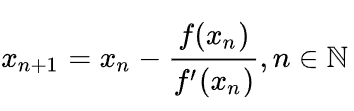

```{r setup, include=FALSE}
knitr::opts_chunk$set(echo = TRUE)
```
--- 

# Objetivo

O objetivo desse relatório é demonstrar métodos de geração de números aleatorios de uma distribuição e métodos para aproximação de distribuições.


# Apresentação do relatório

Aqui será o local para apresentar o material sobre o relatório.

# Conceito de amostra e população

Antes de partirmos para a parte das metodologias, é interessante sabermos a diferença entre amostra e população.

- A população de pesquisa é um conjunto completo de elementos que têm um parâmetro comum entre si. É frequentemente usada para descrever a população humana ou o número total de pessoas que vivem em uma área geográfica de um país ou estado.

- Uma amostra é a menor parte do total, ou seja, um subconjunto de toda a população, ou seja, um subgrupo que pode ser estudado para investigar as características ou o comportamento dos dados da população.

# Gerando números aleatorios de uma distribuição no R

Como, ja aludido no Relatório 3, existem algumas distribuições que podem ser utilizadas para geração de números aleatórios usando o prefixo **r**, tais como: 

```{git}
rnorm ()
rbeta ()
rcauchy ()
rchisq ()
rexp ()
rf ()
rgamma ()
rgeom ()
rlnorm ()
rmultinom ()

```

Além dessas funções já existentes, é possível também criar funções similares com o comando `function`, como:

```{r echo=TRUE}

rexponencial <- function(n, lambda) {
  if(!is.numeric(lambda) | lambda < 0) stop ("O argumento lambda deve ser númerico 
e maior que 0!", call. = FALSE)
  nunif <- runif(n)
  x <- (-log(1 - nunif)) / lambda
  return (x)
}

```

Verificando através da sobreposição dos gráficos:

```{r echo=TRUE}
plot(sort(rexponencial(1000, lambda = 1)))
points(sort(rexp(1000, rate = 1)), col = "red")

```

# Quadratura Gauss-Legendre

Quadraturas gaussianas são quadraturas numéricas de máximo grau de exatidão. Especificamente, quadraturas de Gauss-Legendre são quadraturas gaussianas para integrais da forma

<center>

$\int_{-1}^{1} f(x) dx$

</center>

Sendo assim, a ideia básica consiste em escrever a fórmula geral da quadratura da seguinte forma: 

<center>

$\int_{a}^{b}g(x) dx= \int_{a}^{b}w(x)f(x) dx ~ \sum_{k=1}^{s}wk f(xk)$

</center>

Onde o integrando é escrito g(x) ≡ w(x)f(x), sendo que w(x) possa desempenhar a função peso na fórmula gaussiana.

Assim, os processos para resolução são: 

- Determinar o número de pontos s que devem ser tomados para a resolução da integral, de acordo com o polinômio ps(x);

- Determinar os nós (xk) e os pesos (wk) da quadratura, usando uma função do pacote R, `SMR`, sendo s os pontos da quadratura, expressa por:  

<center

SMR:::GaussLegendre(s)

</center>

- Determinar g(xk) = f(xk), ou seja, a função de interesse aplicada nos nós (xk);

- Por fim, deve-se calcular: 

<center>

$\int_{a}^{b}w(x)f(x) dx ~ \sum_{k=1}^{s}wk f(xk)$

</center>

# Transformação dos limites de integração

Quando a função a ser integrada não está entre -1 e 1, para o uso na quadratura Gaussiana, os limites de integração podem ser transformados para [c* ,d*]

A fórmula padrão da mudança de variável do cálulo de integral utilizando a transformação x = g(t) é dada por:

<center>

$\int_{g(c)}^{g(t)} f(x) dx = \int_{c}^{d} f(g(t))|g'(t)|dt$

</center>

# Método de Newton-Raphson

O método de Newton-Raphson é um dos métodos mais eficientes para a solução numérica de f(x) = 0. Esse método possui ordem de convergência 2. Ele se baseia em um processo iterativo para encontrar a raiz da função. Sendo assim, sua fórmula básica é dada por:

<center>

{width="30%"}

</center>